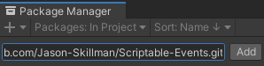

# Mathfs
Expanded Math Functionality for Unity.

## How to install
This package can be installed through the Unity `Package Manager` with Unity version 2019.3 or greater.

Open up the package manager `Window/Package Manager` and click on `Add package from git URL...`.


Paste in this repository's url.

`https://github.com/Jason-Skillman/Mathfs.git`



Click `Add` and the package will be installed in your project.

---
**NOTE:** For Unity version 2019.2 or lower

If you are using Unity 2019.2 or lower than you will not be able to install the package with the above method. Here are a few other ways to install the package.
1. You can clone this git repository into your project's `Packages` folder.
1. Another alternative would be to download this package from GitHub as a zip file. Unzip and in the `Package Manager` click on `Add package from disk...` and select the package's root folder.

---

### Git submodule
Alternatively you can also install this package as a git submodule.

```console
$ git submodule add https://github.com/Jason-Skillman/Mathfs.git Packages/Singleton-Behavior
```

## Features
 - Intersection tests 
   - Ray/Ray
   - Ray/LineSegment
   - Ray/Line
   - Ray/Circle
   - LineSegment/LineSegment
   - LineSegment/Line
   - LineSegment/Circle
   - Line/Line
   - Line/Circle
   - Circle/Circle
 - Trajectory math
   - GetDisplacement (point in trajectory), given gravity, angle, speed & time
   - GetLaunchSpeed, given gravity, angle & lateral distance
   - GetLaunchAngles, given gravity, speed & lateral distance
   - GetMaxRange, given gravity & speed
   - GetHeightPotential, given gravity, current height and speed
   - GetSpeedFromHeightPotential, given gravity, current height and height potential
 - Triangle math
   - Area / SignedArea, given three points or base and height)
   - Contains check, given three triangle vertices and a point to test by)
   - Right-angle trig functions to calculate Opposite/Adjacent/Hypotenuse/Angle
   - Incenter / Centroid
   - Incircle / Circumcircle
   - SmallestAngle
 - Polygon math
   - Area / SignedArea, given a list of points
   - IsClockwise, given a list of points
 - Circle math
   - FromToPoints (get smallest circle passing through both points)
   - FromThreePoints (get unique circle passing through three points)
   - RadiusToArea / AreaToRadius
   - AreaToCircumference / CircumferenceToArea
   - RadiusToCircumference / CircumferenceToRadius
 - 2D Angle helpers (AngToDir, DirToAng...)
 - 2D Vector extension methods (Rotate90CCW/CW, Rotate, RotateAround...)
 - Quadratic & Linear Root finders
 - Remap functions
 - Constants (Tau, Pi, Golden Ratio, e, sqrt2)
 - Vector extension methods (WithMagnitude, ClampMagnitude(min,max)...)
 - Expanded basic math operations to vectors (Clamp, Round, Abs...)
 - Color extensions (WithAlpha, MultiplyRGB...)
 - Smoothing functions (Smooth01, SmoothCos01...)
 - Triangle Math helpers (SignedArea, Circumcenter, Incircle...)
 - Circle Math helpers (Area, Circumference...)
 - All functions use radians
 - And more!

## Changes
Mathfs.cs **does not fully match Unity's Mathf.cs**, I've made a few changes:
 - All angles are in radians, no methods use degrees
 - Lerp and InverseLerp:
   - Unclamped by default
   - LerpClamped/InverseLerpClamped are now the special case functions/exceptions
   - Uses the more numerically stable evaluation
 - Smoothstep is removed in favor of the more explicit:
   - LerpSmooth (which is how it was implemented) and
   - InverseLerpSmooth (which is how it is implemented everywhere but Unity's Mathf.cs)
 - Min/Max functions with arbitrary inputs/array input will throw on empty instead of returning 0
